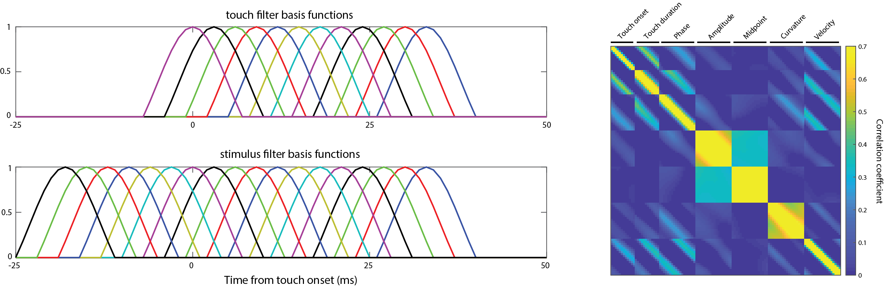
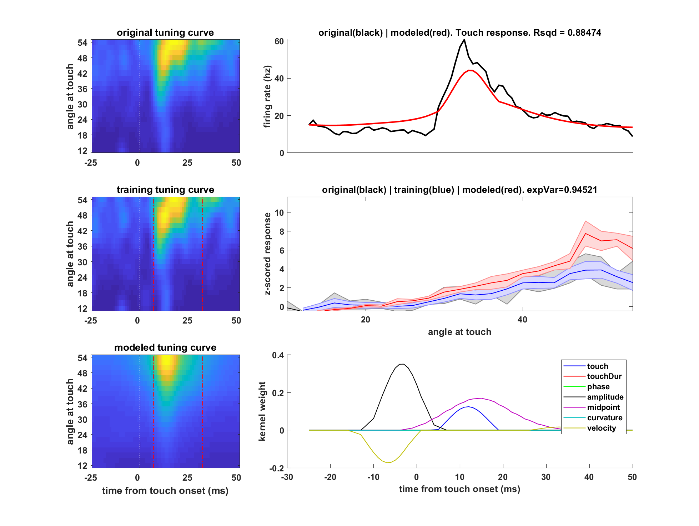

# Active touch remaps barrel cortex output from a representation of self-motion to object location 

## Premise: 
During active tactile exploration, the dynamic patterns of touch are transduced to electrical signals and transformed by the brain into a mental representation not of the self, but of the object under investigation. This transformation from sensation to perception is thought to be a major function of the mammalian cortex. In primary somatosensory cortex (S1) of mice, Layer 5B pyramidal neurons are the main outputs to downstream areas that govern perceptual decision making and motor control. We find that during rhythmic whisker movement, L5B pyramidal neuron activity represents self-motion, encoding whisker azimuthal angle, which is only partially explained by tuning to phase of whisking. Upon active whisker touch, a distinct pattern of activity is evoked that represents the location of the touched object. Object location is decodable to submillimeter precision from the touch-evoked spike counts of a handful of randomly sampled location tuned neurons. This representation does not require specialized training. Surprisingly, the cellular identity and positional preferences of the touch-evoked object location representation were uncorrelated with the self-motion representation during free-whisking. Thus, active touch remaps the output of S1 from a sensory representation of self-motion into a perceptual representation of the explored object. We propose circuit mechanisms for how these two modes of representation are generated in L5B pyramids of S1 and how touch triggers a switch between modes. 

Below are scripts used to characterize encoding and test touch location decoding using single neurons. For summary of all results and findings using this script see Cheung et al., 2020. For a complete description of the behavioral paradigm during neural recordings refer to Cheung et al., 2019. 

## Requirements: 
All code is built and tested on MATLAB 2018b.  
glmnet from Qian and Hastie 2013 - https://web.stanford.edu/~hastie/glmnet_matlab/  
Dataset structures with neural recordings and stimulus variables - Request datasets by emailing jacheung6@gmail.com  

## Main figure builders: 
#### locationCode_DataWrapper
Initial script for compiling behavioral choice, whisking time series, and neural recordings into a packaged structure for analysis. 

#### main_builder_locationTuning
This script compiles whisking and neural time series data into figures for viewing of object location at touch representation. 

#### main_builder_hilbert
This script is responsible for transforming whisking data structure into a design matrix and utilizing a binomial model with ElasticNet regularization for predicting firing rates around touch. Basis functions and lags are responsible for capturing the delay and time course of neural responses from stimulus onsets. These parameters can be modulated within the script.   

Sample of the basis functions used and the correlation between features in the design matrix are shown below.

#### hilbert_plots (CURRENTLY IN BUILD 190509)
This script compiles the optimized binomial models of neural activity around touch and generates the below figures for analysis. 

