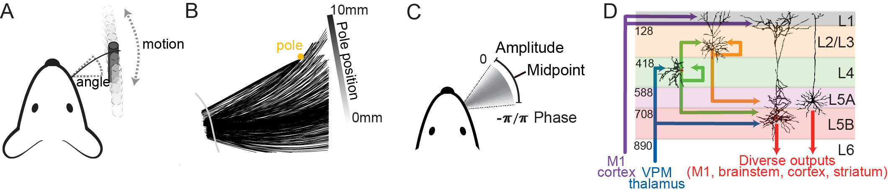

# Independent representations of self-motion and object location in barrel cortex output

## Premise: 
During active tactile exploration, the dynamic patterns of touch are transduced to electrical signals and transformed by the brain into a mental representation of the object under investigation. This transformation from sensation to perception is thought to be a major function of the mammalian cortex. In primary somatosensory cortex (S1) of mice, layer 5 (L5) pyramidal neurons are major outputs to downstream areas that influence perception, decision-making, and motor control. We investigated self-motion and touch representations in layer 5 of S1 with juxtacellular loose-seal patch recordings of optogenetically identified excitatory neurons. We found that during rhythmic whisker movement, 66% of neurons represent self-motion. This population was significantly more modulated by whisker angle than by phase. Upon active touch, a distinct pattern of activity was evoked across L5, which represented the whisker angle at the time of touch. Object location was decodable with submillimeter precision from the touch-evoked spike counts of a randomly sampled handful of these neurons. These representations of whisker angle during self-motion and touch were independent, both in the selection of which neurons were active, and in the angle-tuning preference of co-active neurons. Thus, the output of S1 transiently shifts from a representation of self-motion to an independent representation of explored object location during active touch.  

  
*Mice are trained to locate a pole across various locations (A). During the task, whisker motion (B and C) are captured along with targeted neural recordings to L5 (D) of primary somatosensory cortex.*

  
*Single example trial lasting 4 seconds. Example video (left) along with whisker traces, decomposed components, and spikes recorded from L5 (right)*

## Code:
Packaged under ./matlab are scripts used to characterize encoding and quantify touch location decoding using single neurons. For a summary of all results and findings using this script see Cheung et al., 2020. For a complete description of the behavioral paradigm during neural recordings refer to Cheung et al., 2019. 

## Requirements: 
- All code is built and tested on MATLAB 2018b.  
- glmnet from Qian and Hastie 2013 - https://web.stanford.edu/~hastie/glmnet_matlab/  
- Complete dataset is available for download [here!](https://www.dropbox.com/sh/i9znmsh7q7bphyk/AAAeObJwfwIRMBCa7_Rby5Efa?dl=0). Email jacheung or shires for assitance in using the data.

